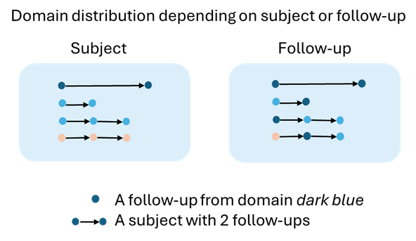
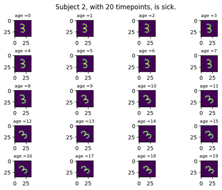
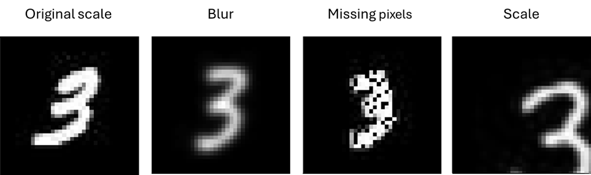
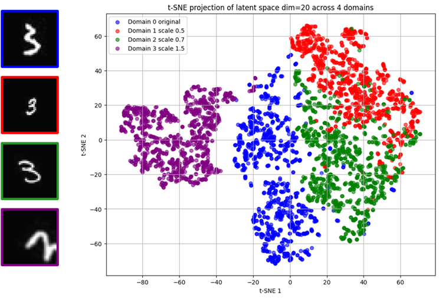

# DomHealthMNIST
---

This synthetic dataset was developed to test regression models for longitudinal image data with domains adaptation in medical application. 

## Overview 
---

Each MNIST digit is a subject, digit 3 and 6 simulate female and male. A subject has a longitudinal data, the variation of MNIST digit create a serie of 20 images. 

Translation (to the right corner): age growing
 
Rotation: disease progression 

Half of the dataset is sick and the other half is healthy, a random rotation, instead of the disease progression, is applicated for all of them. 
Only sick subject has a value for ```disease_time```.
Time can be measure with subject's age growing, in ```time_age``` variable.

Variable to forecast : 
- For classification, the disease status of the subject variable ```disease``` (sick or healthy)
- For regression, the rotation angle variable ```angle```

Then, we assign a domain to every data following your instruction. The boolean variable ```is_various_domain``` indicates how domains are distributed : 
- every follow-up of the subject has the same domain
- follow-ups from a same subject can be associated to different domains, a subject is made from various domains

 

Instructions in ```domain_shifters``` are given to assign domains, according to : 
- colors 
- blur 
- digit scale 
- missing pixels 

Each longitudinal data has 20 images, you can choose to modify it by removing images. This step is used to have different longitudinal structures for each subject, dataset or domain. As in real life application, a patient can miss a appointment and we will still used his data. 

## 1. Original Health MNIST 
---

We need to create the original Health MNIST from *Ramchandran, S., Tikhonov, G., Kujanpää, K., Koskinen, M., & Lähdesmäki, H. (2021). Longitudinal Variational Autoencoder. Proceedings of the Twenty Fourth International Conference on Artificial Intelligence and Statistics (AISTATS)*. Original Health MNIST ends with longitudinal data, with 20 timepoints/follow-ups for each subject.



It returns two csv files, a label and a data file (column ```data``` contains image as a *(3888,) vector tensor*). The mask file is not created at this part, if needed it can automatically be created in the second part. 

### Downloading MNIST digits 
---

- Download MNIST images with *(36x36)* dimension and unzip archive from [here](https://www.dropbox.com/s/j80vfwcqqu3vmnf/trainingSet.tar?dl=0)

### Generating experiment data
---

- Comparing to original Health MNIST, we followed their creations guidelines except some details. Our result dataset doesn't have missing pixels, this step will be possible during the domain spliting. Moreover, you can choose the image dimensions between *(36x36)* or *(36x36x3)*. We are now able to process colors variations because we add three 3 channels.

- Before you have to make sure that result folder exists. 

- To create the dataset, run (it is a slighly different version of the original python file):
```python health_MNIST_v2_generate.py --source=./trainingSet --destination=./result --num_3=10 --num_6=10 --data_file_name=health_MNIST_data.csv --labels_file_name=health_MNIST_label.csv --dim_image=1296```

```num_3``` and ```num_6``` can go to 1 normally up to 4137 (depending on the number of digits in trainingSet folder). 

The argument ```--dim_image``` indicate the dimension of the data processed, i.e., image as a line (1296 or 3888).

## 2. Splitting dataset into domains to create DomHealth-MNIST
---

- Files created are named *domHealth_MNIST_data* for data, *domHealth_MNIST_mask* for masks and *domHealth_MNIST_label* for labels by default. 

Changement occured : 
- In the new label file, a column ```domain``` is added with a numeric number corresponding to each domains and a column ```dataset``` (by default but you can choose its name with the argument ```--name_dataset_separation```) split the dataset into smaller ones (choose the number with argument ```--nb_dataset_separation```). 
- In the new data file, images are changed following instructions given. 
- The dimension of the data processed can also be in 3D, i.e., image as a line 1296 or 3888 for the 3D. 
- In order to create irregular longitudinal data, it is possible to remove some follow-ups with the python file ```change_longitudinal_structure.py```.


#### How to give instructions ? 
---

Give a list in ```domain_shifters``` variable, every element of this list correponds to a domain. Each element is a list of instructions for a domain. An instruction is a tuple *(title_instruction, value)*. For example, ```domain_shifters=[[],[('scale',0.5)],[('scale',0.7), ('color','FF0000')],[('scale',1.5)]]```

In the example, there are 4 domains : 
- Domain 0 has no change 
- Domain 1 has a different scale with smaller digit 
- Domain 2 has also a different scale **and** a different color 
- Domain 3 has bigger digit 

As previously said, to split into different domains, we can manipulate color, blur, scale and the amount of missing pixels.

 


| Changement  | title_intrusction | Values      |
|-------------|-------------------|-------------|
| color    | *color*       | hexadecimal without the prefix #   |
| blur | *blur*        | 0 < value   |
| digit scale | *scale*        |  0 < value  |
| missing pixels | *missing*        | 0 <= value <= 100   |


### Generating final experiment data with domains splitter 
---

The 25% missing pixels are not automatically done, you have to specify it in all domains instructions if you want it.

 
- To create the dataset, run :
```python domHealth_MNIST_generate.py --source=./result --destination=./result --data_file_name=health_MNIST_data.csv --labels_file_name=health_MNIST_label.csv --domain_shifters="[[],[('scale',0.5)],[('scale',0.7)],[('scale',1.5)]]" --is_various_domain=true --nb_dataset_separation=4```

If you want ```is_various_domain=False```, don't specify it in the command line, otherwise any response is considered as a True value. 

### Removing follow-ups 
---

*You have to do this step after domains splitter because you need a mask file.* 

Removing follow-ups/images change the structure of the longitudinal data, to have patients having a different numbers of follow-ups and not the same timepoints. 

With the ```--target``` argument, you can apply a general instruction (by default) or one for each dataset/domain by specifying a column name (for example *domain* or *dataset*).

Two instruction ways to remove follow-ups exist, the ```--list_timepoint_to_remove``` argument let you specify a list of follow-ups you want to remove and the ```--nb_timepoint_to_remove``` argument stores a number of random timepoint you want to remove for each subject. 

- For example to create an alternative dataset where all the pair number of follow-ups are removed, run : 
```python change_longitudinal_structure.py --source=./result --destination=./result  --labels_file_name=domHealthMNIST_various_label.csv --data_file_name=domHealthMNIST_various_data.csv --target=dataset --list_timepoint_to_remove="[[0, 2, 4, 6, 8, 10, 12, 14, 16, 18], [1, 3, 5, 7, 9, 11, 13, 15, 17, 19],[0, 1, 2, 3, 4, 5, 6, 7, 8, 9],[10, 11, 12, 13, 14, 15, 16, 17, 18, 19]]" ``` 


## 3. Domains visualisation 
---

After using a basic VAE trained on 4000 images from domain 0, we tested the VAE to get the latent representation of data from different domains. 

We trained a basic VAE on 4000 images from domain 0 as single data not as longitudinal data. Then, we tested the VAE to get the latent representation of data from different domains. 


 
